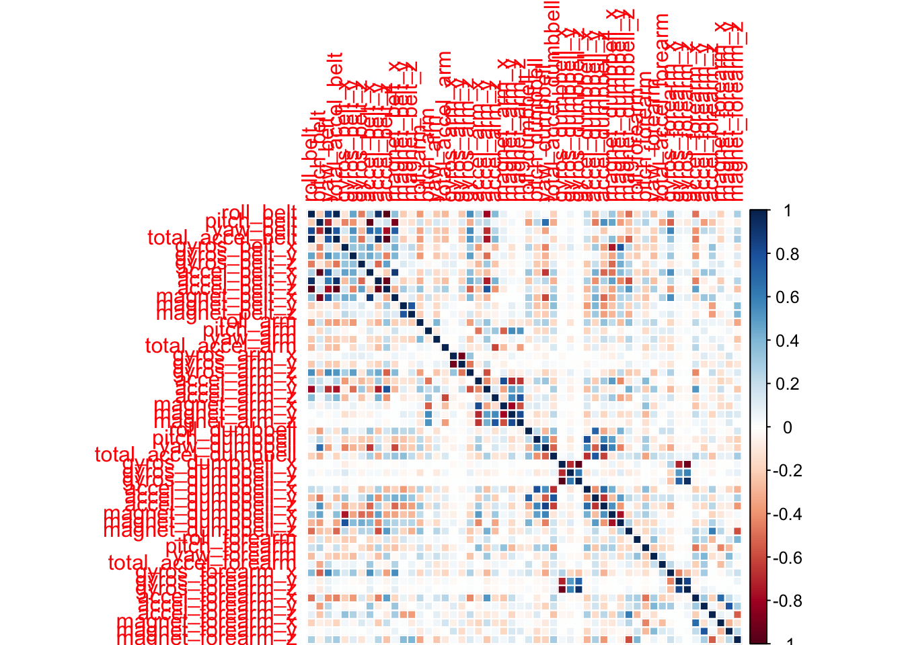

# Machine Learning Write Up
Gabriel Mohanna  


# Executive Summary
In this project, we predict 6 classes of variables using the Random Forest package.  Random subjects were asked to correctly preform a unilateral dumbbell biceps curls then also asked to preform the same exercise incorrectly in four different ways.  The subjects wore sensors on different parts of their bodies as well as on the dumbbells they were lifting.

The overall out-of-sample error was 0.41%.

The classes we are predicting consist of the following:

- A: Correct unilateral dumbbell biceps curl
- B: Throwing the elbows to the front
- C: Lifting the dumbbell only halfway
- D: Lowering the dumbbell only halfway
- E: Throwing the hips to the front


# Methodology
The initial data consisted of 160 variables but most of which contained 98% missing or NA values as well as personal identification variables that we weren't interested in.  Hence, we decided to simply drop these variables from both the training and test data.  We partitioned the initial data into training and test data sets.  We then used the final "testing" data as a validation for submission on the course website.  We got all the cases correct.

We built multiple models with different methodologies but only choose Random Forest at the end due to speed of calculation and it's accuracy.  Other models that we built were Regression Trees and Neural Network.  We also built these same models using Principle Component Analysis but the overall model fit wasn't as good as when using all the variables.  This is because PCA will reduce dimentionality but that is needed for classification problems.

**Coding Steps:**

1. Read and clean data
2. Partition the data in training and testing sets
3. Build a model with randomForest() function on training dataset
4. Evaluate out-of-sample Accuracy, i.e. cross-validation
3. Predict on final validation set


## R Code
### Data Reading & Cleaning

```r
# Load Libraries
library(caret)
library(randomForest)
library(corrplot)
```


```r
# Read and Clean Data
data <- read.csv("Data/pml-training.csv", na.string = c("NA", ""))
data.valid <- read.csv("Data/pml-testing.csv", na.string = c("NA", ""))

# Determine Data's NA Columns
table(round(apply(data, 2, function(x) sum(is.na(x)))/nrow(data), 2))
```

```
## 
##    0 0.98 
##   60  100
```

```r
columns.naCount <- apply(data, 2, function(x) sum(is.na(x)))

# Remove Data's NA Columns
columns.NA <- names(columns.naCount)[columns.naCount > 0]
columns.notNA <- names(columns.naCount)[columns.naCount == 0]
data <- data[, columns.notNA]
data <- data[, -c(1:7)]

# Set Seet
set.seed(3599)

# Partition Data
inTrain <- createDataPartition(y = data$classe, p = 0.75, list = F)
data.train <- data[inTrain, ]
data.test <- data[-inTrain, ]
```

### Modeling Building

```r
# Explore Data
cor.data <- cor(data[, -53])
corrplot(cor.data, method = "color")
```

 

```r
# Train Random Forest
modFit.RF <- randomForest(classe ~ ., data = data.train)

# Compare Out-of-Sample Errors
percent <- function(x, digits = 2, format = "f", ...) {
    paste0(formatC(100 * x, format = format, digits = digits, ...), "%")
}

# Confusion Matrix
confMatrix <- confusionMatrix(data.test$classe, predict(modFit.RF, data.test))

confMatrix
```

```
## Confusion Matrix and Statistics
## 
##           Reference
## Prediction    A    B    C    D    E
##          A 1393    2    0    0    0
##          B    4  942    3    0    0
##          C    0    2  853    0    0
##          D    0    0    8  795    1
##          E    0    0    0    0  901
## 
## Overall Statistics
##                                         
##                Accuracy : 0.996         
##                  95% CI : (0.994, 0.998)
##     No Information Rate : 0.285         
##     P-Value [Acc > NIR] : <2e-16        
##                                         
##                   Kappa : 0.995         
##  Mcnemar's Test P-Value : NA            
## 
## Statistics by Class:
## 
##                      Class: A Class: B Class: C Class: D Class: E
## Sensitivity             0.997    0.996    0.987    1.000    0.999
## Specificity             0.999    0.998    1.000    0.998    1.000
## Pos Pred Value          0.999    0.993    0.998    0.989    1.000
## Neg Pred Value          0.999    0.999    0.997    1.000    1.000
## Prevalence              0.285    0.193    0.176    0.162    0.184
## Detection Rate          0.284    0.192    0.174    0.162    0.184
## Detection Prevalence    0.284    0.194    0.174    0.164    0.184
## Balanced Accuracy       0.998    0.997    0.993    0.999    0.999
```

```r
# Out-of-Sample Error Rate
percent(1 - confMatrix$overall[[1]])
```

```
## [1] "0.41%"
```

### Final Prediction

```r
predict(modFit.RF, data.valid)
```

```
##  1  2  3  4  5  6  7  8  9 10 11 12 13 14 15 16 17 18 19 20 
##  B  A  B  A  A  E  D  B  A  A  B  C  B  A  E  E  A  B  B  B 
## Levels: A B C D E
```
